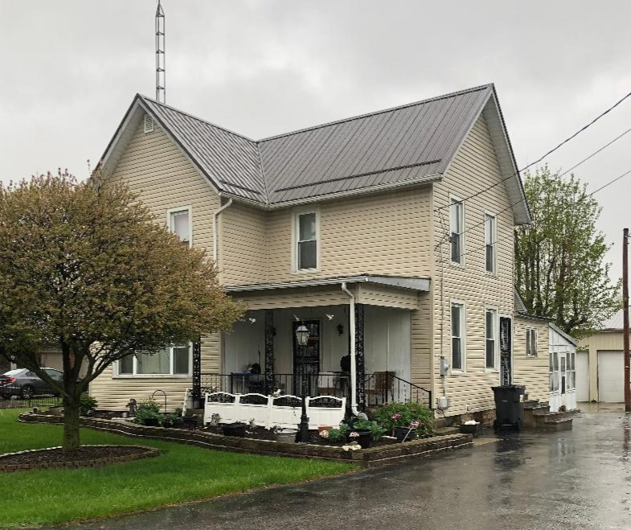
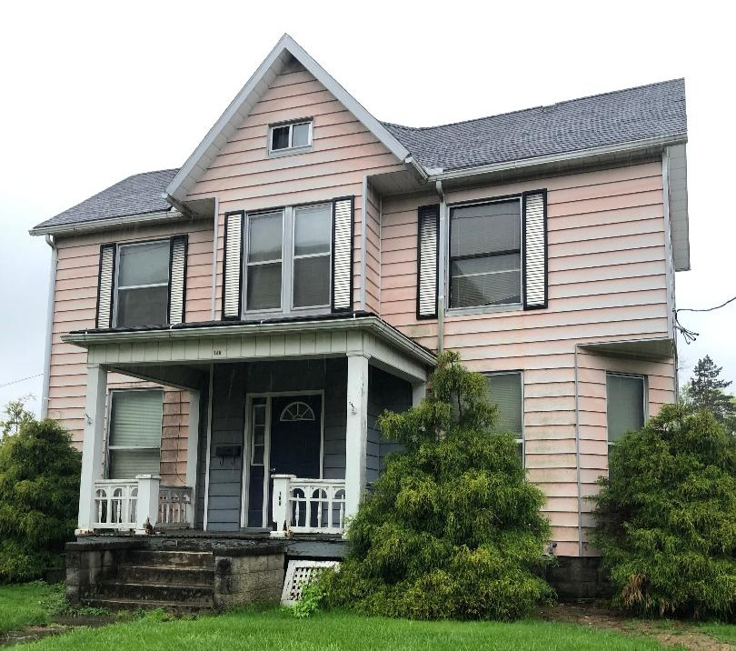
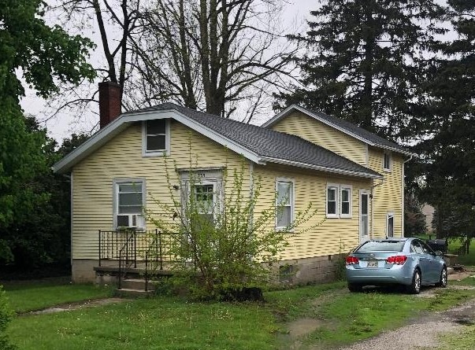
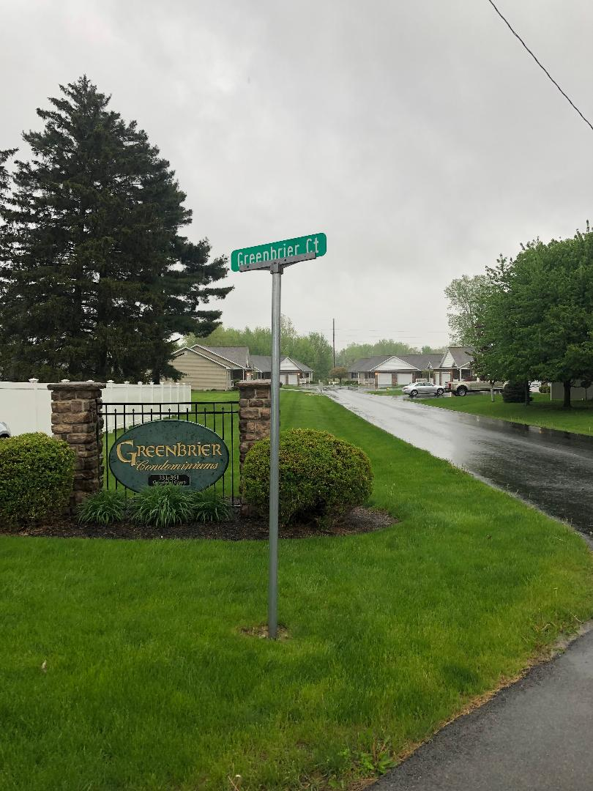
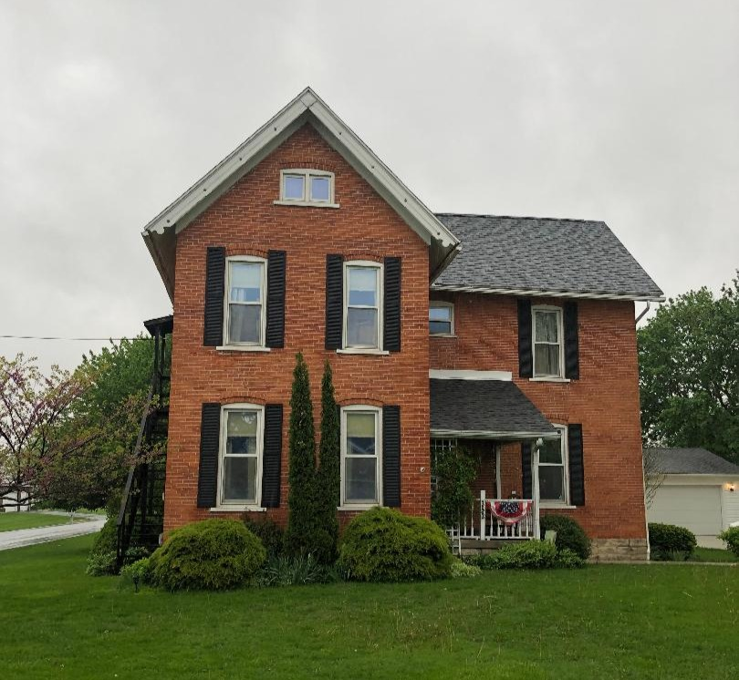
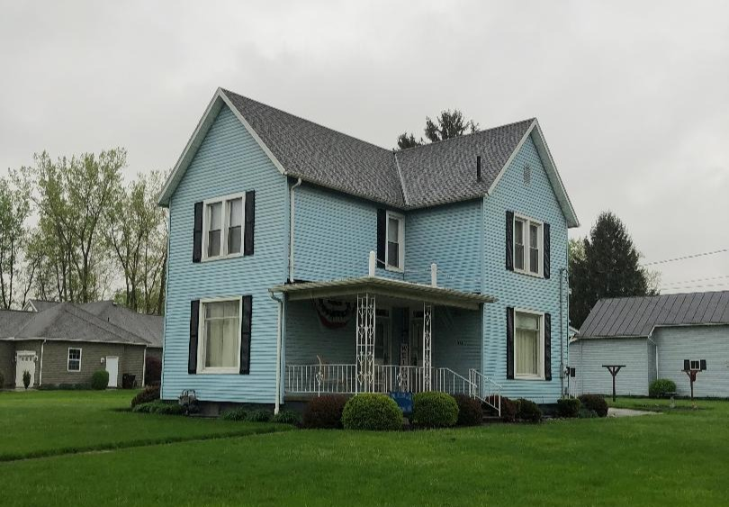
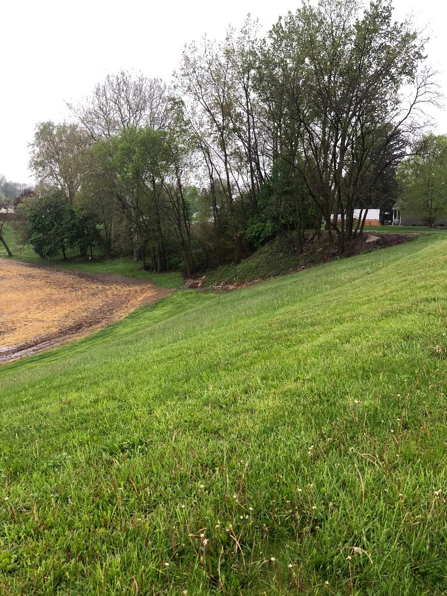

# Locations

These are all recent photos of important locations.  If you have time-dated photos, send them to me and
I will add them so that you can flip back and forth.

This is [Our Family Tree](https://www.gase.nl/Internettree/f5955.htm) as recorded by **The Family Tree of the American Gase** family.
It is not updated that much any more, but you can email Ronald Gase with corrections (see the bottom of each page); I have done it
before and eventually he will respond. *Mr. Gase lives in Germany and somehow has ties to Tiffin and sometimes visits*.
You can follow our ancestories back many generations on Mom and Dad's side.

****************

**1138 County Road 13**               

This is where Mom was born.  CR 13 runs North/South just East of Tiffin. It connects
Coe (Greenlawn Cemetary) and Greenfield (Wagners Flower Shop).

****************

**122 Greenfield Street** 

This house is across from National Machinery at the corner of Greenfield and Prospect. This is
Dad and Mom's first house, which they rented. Jane, Sara and John(?) were born here.

****************

**165 Circular St**               

Our house as it is now.  Photo needed!

****************

**335 Greenfield Street** 

The Hoover house.

****************

**Greenbrier Ct** 

This street is between the Hoover home and the Kuhn home.
If you follow it, you can go back to the "garden" and relive throwing potatoes
onto the railroad track.  Supposively there was a house trailer of some kind here many
years ago.  This is where...

****************

**353 Greenfield Street** 

The Kuhn house.

****************

**328 Greenfield Street** 

Mom's best friend lived here.  I only included it because Mom was so fond of her
experiences there.

**The Sledding Hill** 

Where we used to go sledding; Bull run.

****************