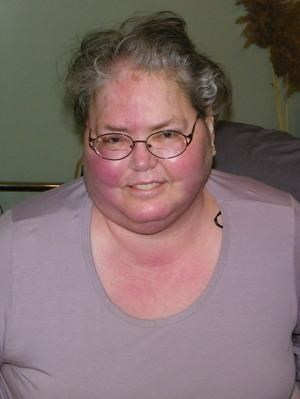
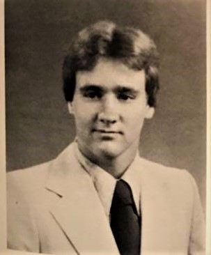

# Tiffin Columbian 1981 Obituaries

Back to **[Tiffin Columbian](../README.md)** --- **[Past Reunions](pastReunions.md)**

| Name                                                            | Date       | Age | Birth      | Resident Of       | Obituary | Other |
| :-------------------------------------------------------------: | ---------- | --- | ---------- | :---------------- | :-------- | :-----: |
| **James Roe**                            | 11/01/1979 | 16  | 01/18/1963 | Tiffin            | *Obituary not yet Identified* | [news](newz/James-Roe.md) |
| **William 'Bill" Zellner**               | 05/01/1980 | 17  | 03/10/1963 | Tiffin            | *Obituary not yet Identified* | [news](newz/Bill-Zellner.md) |
| **Charles "Chuck" Ward**                 | 04/04/1981 | 18  | 03/31/1963 | Tiffin            | [Wiketree](<https://www.wikitree.com/wiki/Ward-3909>) | [news](newz/Charles-Ward.md) |
| **Lance Fletcher**                       | 10/29/1989 | 26  | 10/22/1963 | Tiffin            | *Obituary not yet Identified* | [news](newz/Lance-Fletcher.md) |
| **Judith Bonham Hammer**                 | 04/23/1993 | xx  | mm/dd/yyyy | ...               | *Obituary not yet Identified* | |
| **Frederick 'Fred" Traxler**             | 08/27/1994 | 31  | 01/24/1963 | Litchfield        | *Obituary not yet Identified* | [news](newz/Fred-Traxler.md) |
| **Raymond "Ray" Loesser**                | 09/04/2001 | 38  | 08/02/1963 | Tiffin            | [Traunero](<https://www.traunerofuneralhome.com/obituary/DrRAYMOND-LOESSER>) | |
| **Jeffery "Jeff" Raitz**                 | 02/09/2002 | 38  | 03/03/1963 | Mesquite, Texas   | [Wrestling Classic](<http://wrestlingclassics.com/cgi-bin/.ubbcgi/ultimatebb.cgi?ubb=print_topic;f=9;t=044680>) | [Gary Young vs Jeff Raitz Power Pro April 18th, 1987](https://www.youtube.com/watch?v=z1x5MdhlgXE) |
| **Linda Tyree Fitzgerald**           | 05/13/2002 | 38  | 06/02/1963 | Tiffin            | [Traunero](<https://www.traunerofuneralhome.com/obituary/LINDAGAILTyree-FITZGERALD>) | |
| **Jennifer "Jenny" Martin Kneeskern**    | 02/09/2012 | 48  | 05/20/1963 | Tiffin | [Traunero](<https://www.traunerofuneralhome.com/obituary/JENNIFER-KNEESKERN>) | |
| **Sheila Goshe Berry**                   | 12/21/2014 | 51  | 01/03/1963 | Tiffin            | [Gase](<https://www.gase.nl/Internettree/f12801.htm>) | |
| **Connie Lang**                | 06/02/2015 | 52  | 11/03/1962 | Port Clinton      | [Legacy](<https://www.legacy.com/us/obituaries/portclintonnewsherald/name/connie-lang-obituary?pid=175009344>) | |
| **James Davis**                   | 00/00/2017 | xx  | mm/dd/yyyy | San Francisco, CA | [Smart Wires Obituary](https://www.topionetworks.com/people/james-davis-5b545b04105eb56f88991231 "There is an annoying pop-up that appears within 10 seconds that eliminates your ability to view") | |
| **Douglas C. McIntyre**    | 01/10/2017 | 54  | 01/26/1962 | Fremont           | [Wonderly Horvath Hanes](<https://www.wonderlyhorvathhanesfuneralhome.com/douglas-c-mcintyre>) | |
| **Joseph "Joe" Turner**            | 08/15/2018 | 55  | 05/19/1963 | Tiffin            | [HG Mack](<https://www.hgmackfuneralhome.com/obituary/Joseph-Turner>) | |
| **Josine "Josie" Bell**               | 12/04/2018 | 57  | mm/dd/yyyy | Coldwater         | [HG Mack](<https://www.hgmackfuneralhome.com/obituary/JosineJosie-Bell>) | |
| [**Belinda Bargaheiser Cavazos**](jpgz/BelindaCavazos.jpg) | 09/21/2019 | 56  | 01/03/1963 | Marion | [Cremation Services](<https://www.cremationservicesofohio.com/obituaries/Belinda-Cavazos/#!/Obituary>) |
| **Brent Whitmer**                        | 01/11/2020 | 57  | 09/26/1962 | Tiffin            | [Shook Family](<https://www.shookfamilyfh.com/obituary/Brent-Whitmer>) | |
| [**Diane "DeeDee" Lange**](jpgz/DianeLange.jpg)       | 04/26/2020 | 57  | 01/15/1963 | Tiffin            | [Shook Family](<https://www.shookfamilyfh.com/obituary/Diane-Lange>) | |
| [**Lewis "Lew" Slemmer**](jpgz/LewisSlemmer.jpg)    | 06/01/2021 | 58  | 03/21/1963 | Tiffin            | [Traunero](<https://www.traunerofuneralhome.com/obituary/Lewis-Slemmer>) | |
| [**Brad Boehler**](jpgz/BradBoehler.jpg)             | 04/02/2022 | 59  | 11/19/1962 | Tiffin            | [Shook Family](<https://www.shookfamilyfh.com/obituary/Brad-Boehler>) | |
| **Tammy J. (Howard) Kinn**       | 06/15/2022 | 59  | 05/24/1963 | Tiffin            | [Traunero](<https://www.traunerofuneralhome.com/obituary/Tammy-Kinn>) | |
| **Dennis Angelbeck**       | 08/31/2022 | 59  | 08/02/1963 | New Riegel        | [HG Mack](<https://www.hgmackfuneralhome.com/obituary/Dennis-Angelbeck>) | |
| **Mark A. Frankart**                     | 09/09/2022 | 59  | 05/12/1963 | Bloomville        | [Shook Family](<https://www.shookfamilyfh.com/obituary/Mark-Frankart>) | |
| **Edward Lee "Ed" Sours**     | 09/13/2022 | 60  | 03/30/1962 | Tiffin            | [Hoening](<https://hoeningfuneralhome.secure.tributecenteronline.com/obituaries/Edward--Lee-Ed-Sours?obId=25886125>) | |
| **Alex J. Rohrbach**          | 10/02/2022 | 59  | 09/06/1963 | Tiffin            | [HG Mack](<https://www.hgmackfuneralhome.com/obituary/Alex-Rohrbach>) | |
| [**William "Bill" M. Black**](jpgz/BillBlack.jpg)     | 09/22/2024 | 61  | 10/10/1962 | Tiffin            | [HG Mack](<https://www.hgmackfuneralhome.com/obituary/WilliamBill-Black>) | |
| **Timothy Vassalle**       | 08/08/2025 | 62  | 04/09/1963 | Tiffin            | [Hufford Family](<https://www.huffordfh.com/obituary/Timothy-Vassalle>) | |
| **Stephen Birch Jr.**       | 11/06/2025 | 62  | 09/17/1963 | Tiffin            | [Shook Family](<https://www.shookfamilyfh.com/obituary/Stephen-BirchJr>) | |

# How You Can Help

Completing this page is a multi-faceted affair.  You can help by doing any of the following:

- [Micro Fiche Research](library.md)
- [Internet Research](internet.md)
- [Yearbook Photos](yearbook.md)
- [Geek Work](geekwork.md)
- [Contact Me](contactme.md)
